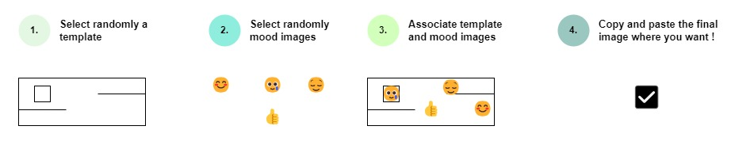

# moodMosaic


[](https://github.com/jdasilvalima/moodMosaic/commits)

## Project description

### Introduction

MoodMosaic create a visual representation of collective emotions through the fusion of randomly selected mood images 🎨. It is combining the different states of mind, from joy and satisfaction to frustration and concern, into a single composite image. In every sprint retrospective, each team member's can express their sentiments and reflections on the just-concluded sprint easily with MoodMosaic.

### Processus



## Project Setup

### Requirements
- [NodeJS](https://nodejs.org/en) >= 10.16 and [npm](https://www.npmjs.com/) >= 5.6 installed
- [Git](https://git-scm.com/) installed in the system
- [VSCode](https://code.visualstudio.com/) + [Volar](https://marketplace.visualstudio.com/items?itemName=Vue.volar) (and disable Vetur) +
- [TypeScript Vue Plugin (Volar)](https://marketplace.visualstudio.com/items?itemName=Vue.vscode-typescript-vue-plugin).

**Clone the repository**
```sh
git clone git@github.com:jdasilvalima/moodMosaic.git
```

**Checkout directory**
```sh
cd moodMosaic/mosaicMaker
```

**Install Dependencies**
```sh
npm install
```

**Compile and Hot-Reload for Development**
```sh
npm run dev
```

**Type-Check, Compile and Minify for Production**
```sh
npm run build
```

**Run Unit Tests with [Vitest](https://vitest.dev/)**
```sh
npm run test:unit
```

**Run End-to-End Tests with [Playwright](https://playwright.dev)**
```sh
# Install browsers for the first run
npx playwright install

# When testing on CI, must build the project first
npm run build

# Runs the end-to-end tests
npm run test:e2e
# Runs the tests only on Chromium
npm run test:e2e -- --project=chromium
# Runs the tests of a specific file
npm run test:e2e -- tests/example.spec.ts
# Runs the tests in debug mode
npm run test:e2e -- --debug
```

**Lint with [ESLint](https://eslint.org/)**
```sh
npm run lint
```

## MoodMosaic Image Examples